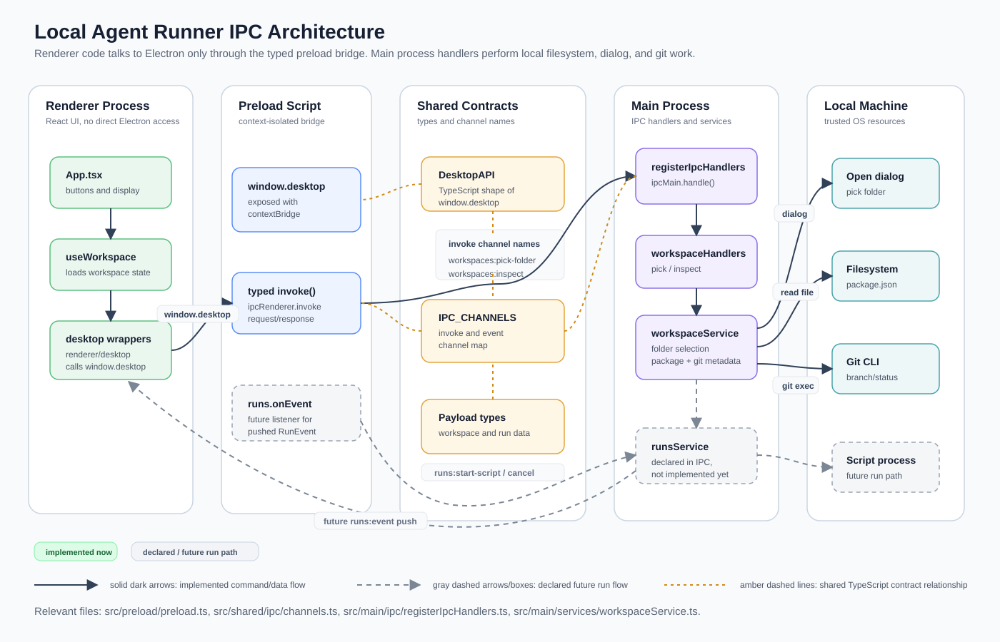

# IPC Architecture

This diagram shows how Local Agent Runner routes renderer actions through the typed preload bridge into Electron main-process IPC handlers, and how those handlers reach local filesystem, dialog, git, and future run-process services.

